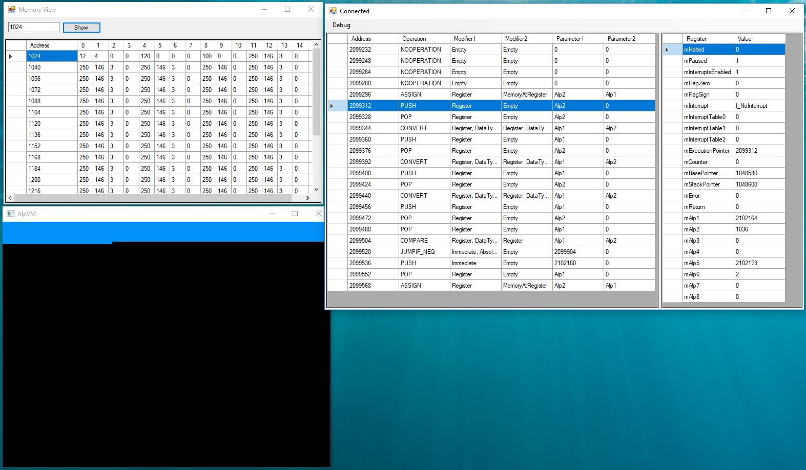

# Summary
AlpVM is a simple virtual machine I developed in 2013 just for fun. It wasn't easy to write programs for it in its own machine language. So, I decided to make some high level languages available to it.
Now, it is possible to program it in C. To achieve this, I also write an assembler and a linker. For C compiler I used LCC. Assembler, and linker are written in C#. AlpVm is written in C++.

# AlpVM
AlpVM has a simple interrupt mechanism and also video, keyboard, and timer devices all of which are controlled by memory mapped I/O.
Since it is a simple machine, it has no memory protection support. So the code runs on it can modify itself.
Assembler and linker produce executables containing symbols (like an ELF or PE file) so that AlpVM can make relocation to achieve position independent code. Linker also makes relocations when combining object files to produce an executable.
Instructions of AlpVM are fixed-sized (16 bytes).

#### Components
- [CPU](CPU.md)
- [Interrupts](Interrupts.md)
- [Video](Video.md)
- Keyboard
- Timer

# Building
- **AlpVM**: Open AlpVM solution and build it with Visual Studio
- **Assembler, Linker, Debugger**: Open AlpVM-Assembler solution and build it with Visual Studio
- **LCC**: Open Visual Studio x86 Command Promt, cd to lcc path and run build.bat

# Building for AlpVM
To run a C code in AlpVM, the code must be built by following these steps:
- Compile code(s) - run compilec.bat batch file and pass a C file as the argument
- Assemble - run AlpVM-Assembler.exe with the argument `a` (assembler) to assemble and create an object file
- Link - run AlpVM-Assembler.exe with the argument `l` (linker) to link object files together and create a runnable

#### Building sample.c

    compilec.bat examples\sample.c
    
This should have created sample.c.asm.

    AlpVM-Assembler.exe a sample.o examples\sample.c.asm

This should have created sample.o.

    AlpVM-Assembler.exe l sample.alp sample.o

This should have created sample.alp. If it is intended to link multiple object files, they should be passed to the end as arguments.
Now, sample.alp can be run in AlpVM.

    AlpVM.exe sample.alp
    
If `debug` is passed to the end as an argument, AlpVM breaks immediately and waits debugger to connect.

# Debugger
AlpVM debugger is a C# Windows Forms application capable of connecting AlpVM via TCP connection. It can read registers and memory of the machine, disassemble the code where execution pointer is and control the machine's state.

Note that, this is a hobby project so codes here are not expected to be the most efficient.
